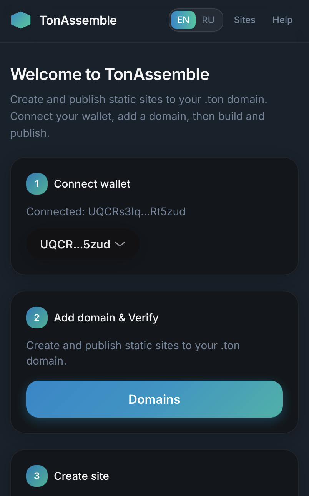
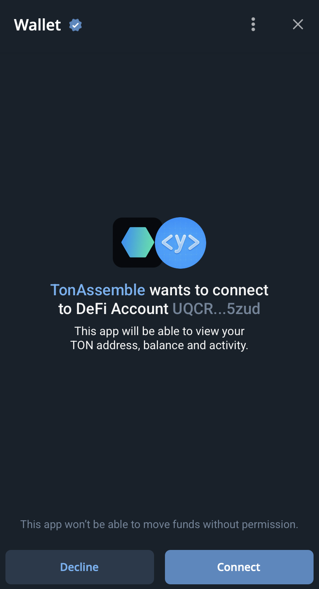
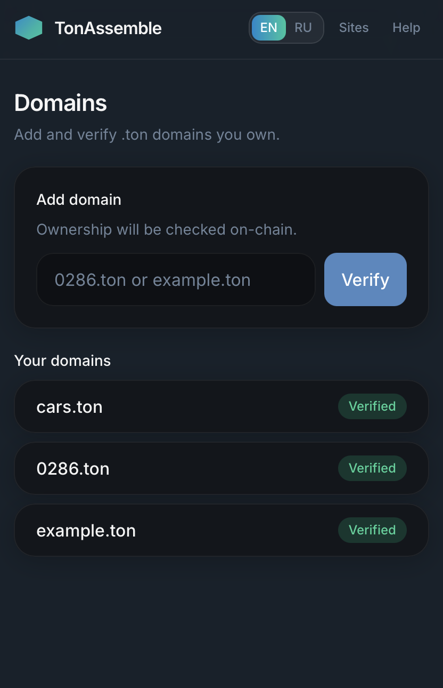
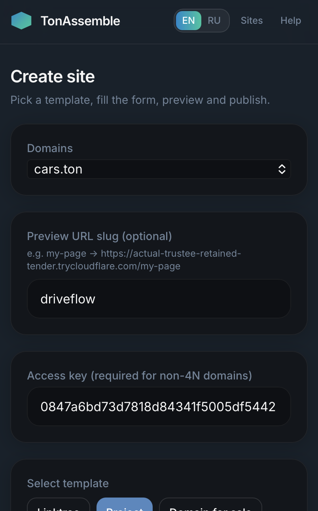
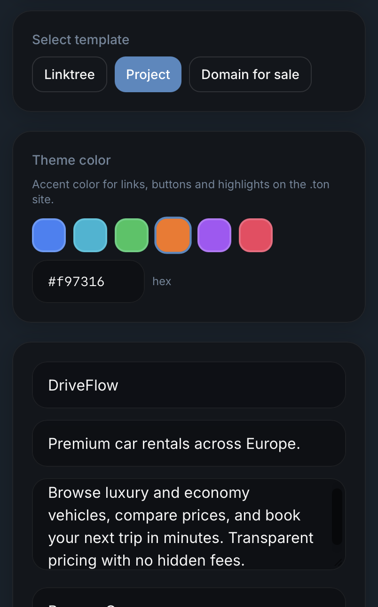
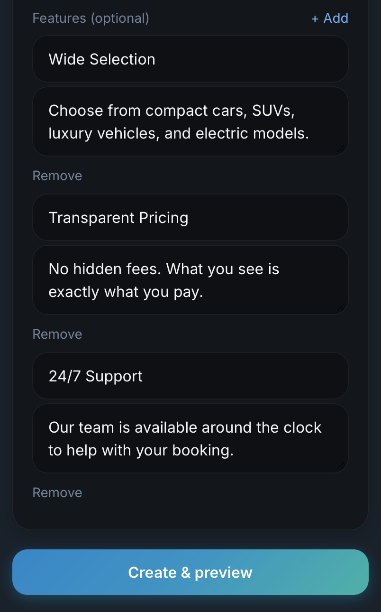
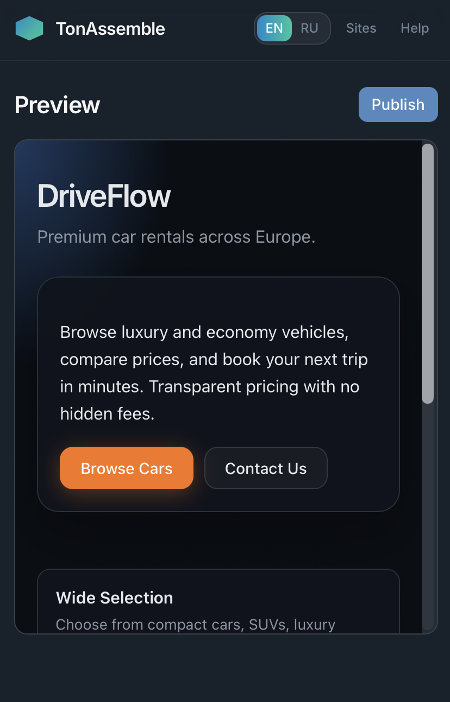
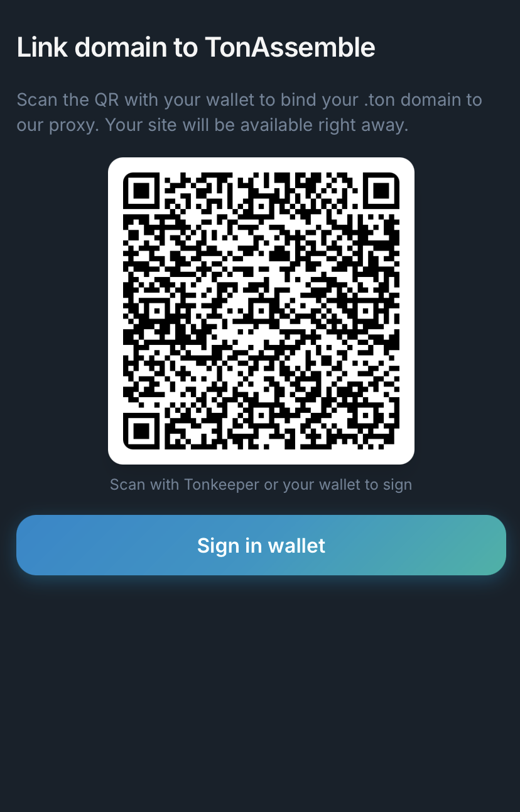

# TonAssemble

[](https://github.com/turrz/ton-assemble/actions/workflows/ci.yml)

TonAssemble is a full-stack Telegram Mini App for creating and publishing simple websites for `.ton` domains.

It demonstrates a production-style TypeScript monorepo with a Fastify API, Telegram bot, React Mini App, SQLite persistence, TON Connect wallet linking, on-chain `.ton` ownership checks, and TON DNS publish flows.

## Features

- Telegram Mini App built with React, Vite, and TON Connect UI
- Telegram bot entry point with app, preview, and admin access-key commands
- TON wallet linking through Telegram Web App init data
- `.ton` domain ownership verification on mainnet
- Static site creation from validated templates
- Site preview and public slug routes
- Publish flow for TON DNS site records
- Optional TON Storage or ADNL reverse-proxy publishing mode
- SQLite data layer with automatic startup migrations

## Screenshots

The flow below follows the main user journey from onboarding to publish.

### Home

<p align="center">
  
</p>
<p align="center"><em>Home screen with the onboarding checklist: connect a wallet, verify a domain, then create a site.</em></p>

### Connect wallet

<p align="center">
  
</p>
<p align="center"><em>TON Connect authorization before the app can read your wallet address and link it to your Telegram account.</em></p>

### Verify domain

<p align="center">
  
</p>
<p align="center"><em>Add a `.ton` domain and verify on-chain ownership before creating a site.</em></p>

### Create site

<p align="center">
  
</p>
<p align="center"><em>Choose a verified domain, optional preview slug, template, and access key when required.</em></p>

<p align="center">
  
</p>
<p align="center"><em>Pick a template, set the theme color, and fill in site content.</em></p>

<p align="center">
  
</p>
<p align="center"><em>Add navigation links and feature blocks, then continue to create the site and open the preview.</em></p>

### Preview

<p align="center">
  
</p>
<p align="center"><em>Preview the rendered site and confirm layout, links, and content before publishing.</em></p>

### Publish

<p align="center">
  
</p>
<p align="center"><em>Sign the TON DNS transaction in your wallet to link the domain to TonAssemble and go live.</em></p>

## Tech Stack

- **Language:** TypeScript
- **Runtime:** Node.js 20
- **API:** Fastify
- **Bot:** Telegraf
- **Web:** React, Vite, Tailwind CSS
- **Validation:** Zod
- **Database:** SQLite, better-sqlite3
- **TON:** `@ton/core`, `@ton/ton`, TON Connect
- **Monorepo:** npm workspaces (pnpm-compatible scripts)
- **Deployment:** Docker, docker-compose

## Architecture

TonAssemble is organized as a small monorepo:

- The Telegram bot opens the Mini App and provides helper commands.
- The web app uses Telegram init data to authenticate API requests.
- The API verifies Telegram init data, stores users, domains, and sites, renders templates, and prepares TON DNS transactions.
- Shared packages isolate database access, TON client logic, DNS operations, storage integration, and template rendering.

The API serves both JSON endpoints and the built Mini App and static site pages from the same origin.

## Project Structure

```text
apps/
  api/      Fastify API, public routes, services, auth middleware
  bot/      Telegram bot
  web/      React Telegram Mini App

packages/
  blockchain/  TON client helpers
  db/          SQLite access layer
  dns/         .ton ownership and DNS transaction logic
  storage/     TON Storage integration
  templates/   Static website templates
```

## Quick Start

### Prerequisites

- Node.js 20+
- npm (recommended) or pnpm
- Telegram bot token from [BotFather](https://t.me/BotFather)
- TON mainnet RPC endpoint

### Install dependencies

```bash
npm install
```

### Configure environment

```bash
cp .env.example .env
cp apps/web/.env.example apps/web/.env
```

Fill in the required values before starting the services:

- `BOT_TOKEN`
- `PUBLIC_BASE_URL`
- `TON_RPC_URL`
- either `TON_PROXY_ADNL_HEX` or all `TON_STORAGE_*` variables

Set `VITE_API_URL` in `apps/web/.env` to the same public origin as `PUBLIC_BASE_URL`.

### Build

Build shared packages and apps in dependency order:

```bash
npm run build --workspace=@ton-site-builder/db
npm run build --workspace=@ton-site-builder/blockchain
npm run build --workspace=@ton-site-builder/dns
npm run build --workspace=@ton-site-builder/storage
npm run build --workspace=@ton-site-builder/templates
npm run build --workspace=@ton-site-builder/api
npm run build --workspace=@ton-site-builder/bot
npm run build --workspace=@ton-site-builder/web
cp -r apps/web/dist/* apps/api/public/
```

### Run locally

Start the API and bot:

```bash
npm run dev --workspace=@ton-site-builder/api
npm run dev --workspace=@ton-site-builder/bot
```

Run the web app during frontend development:

```bash
cd apps/web
npm run dev
```

Telegram Mini Apps require HTTPS in production. For local end-to-end Telegram testing, use a secure tunnel and set `PUBLIC_BASE_URL` and `VITE_API_URL` to the public HTTPS URL.

### Docker

With `.env` configured, build and start both services:

```bash
docker compose up --build
```

The API is exposed on the port defined by `PORT` (default `3000`). SQLite data is persisted in `./data`.

## Environment Variables

Root `.env`:

```env
BOT_TOKEN=your_telegram_bot_token
PUBLIC_BASE_URL=https://your-public-app-url
WEBAPP_PATH=
ADMIN_TELEGRAM_ID=
DB_PATH=./data/tonassemble.sqlite
PORT=3000

TON_RPC_URL=https://mainnet-v4.tonhubapi.com
TON_NETWORK=mainnet

# Publishing mode A: ADNL reverse proxy
TON_PROXY_ADNL_HEX=

# Publishing mode B: TON Storage
TON_STORAGE_DAEMON_BIN=
TON_STORAGE_DAEMON_HOST=
TON_STORAGE_DB_PATH=

# Optional support links
DONATE_TON_ADDRESS=
DONATE_TEXT=
CONTACT_TELEGRAM=
CONTACT_X=
CONTACT_EMAIL=
```

Web app `.env`:

```env
VITE_API_URL=https://your-public-app-url
VITE_TON_NETWORK=mainnet
```

## License

MIT
